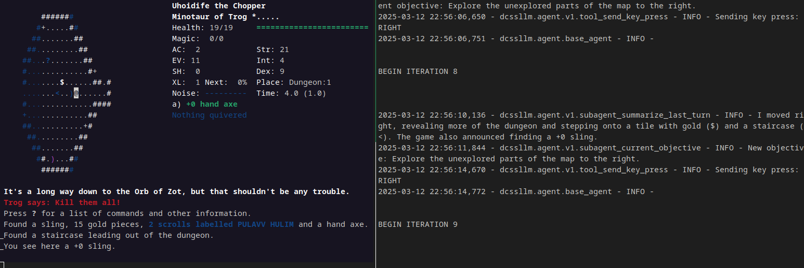

# DCSS-LLM: Agentic LLM Sandbox for Dungeon Crawl Stone Soup



This project implements two things:

1. A harness to connect a [Dungeon Crawl Stone Soup](https://crawl.develz.org/) (DCSS)
game to a LLM, enabling the exploration of agentic systems in the context of a roguelike game.

1. A prototype model-agnostic LLM agent to play DCSS.

## Installation

1. Clone the repository recursively to include the DCSS submodule:

    ```bash
    git clone --recursive https://github.com/randombk/dcss-llm.git
    ```

1. Install using `uv`:

    ```bash
    uv venv && uv pip install -e .
    ```

1. Compile DCSS with custom patches. You may need to install [additional dependencies](https://github.com/crawl/crawl/blob/master/crawl-ref/INSTALL.md) for DCSS.

    ```bash
    bash ./build-crawl.sh
    ```

## Usage

This project is a work in progress, and is not currently configured for easy out-of-the-box use. Edit the `dcssllm/main.py`
file to configure your LLM connections. Then, the `run` script will start DCSS and run the agent.

During play, the following files are created:

* `saves/` and `morgue/` directories: DCSS save files and morgue (player death + crash) files.
* `stderr.log`: Stderr output from the agent. As the main output is the DCSS curses interface, tailing this file is the recommended way to monitor the agent.
* `screen.log`: The current DCSS UI, with full terminal formatting codes. Useful for debugging purposes.
* `text_only_screen.log`: A text-only version of the DCSS screen with terminal opcodes stripped out.
* `llm_data.log`: A dump of the current game state, generated every turn. This is being read into the agent to help it make decisions.

## Agent Design

WIP

## Why DCSS?

Dungeon Crawl is a popular open-source roguelike game featuring a complex blend of tactical and strategic gameplay. The game's 2D grid and turn-based combat system make it a good candidate for exploring agentic systems in a controlled and non-time-constrained environment.

As [others have previously noted](https://arxiv.org/abs/1902.01769), DCSS:

* Requires a "blend of long-term strategic planning where early decisions can have significant impact on later game play."
* Is "an environment that does not penalize slow reaction times", allowing us to run arbitrarily-complex agentic systems to determine the next move.
* Has an excellent [wiki](http://crawl.chaosforge.org/Crawl_Wiki) and in-game textual descriptions, enabling RAGs.
* Text/Curses-based interface is easy to parse and interact with programmatically, allowing us to focus on the agent's decision-making rather than navigating the interface.
